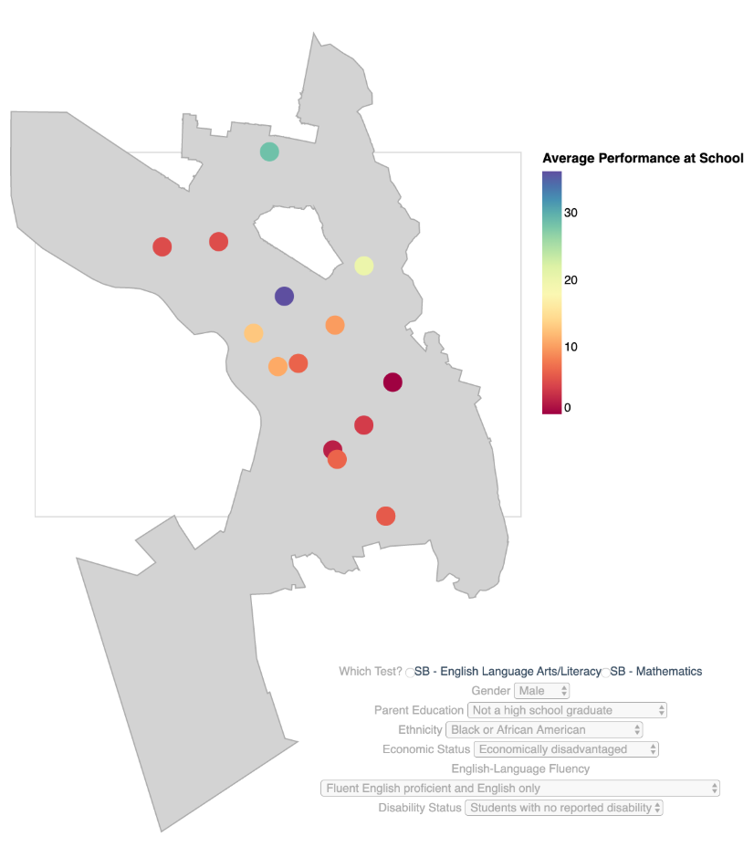
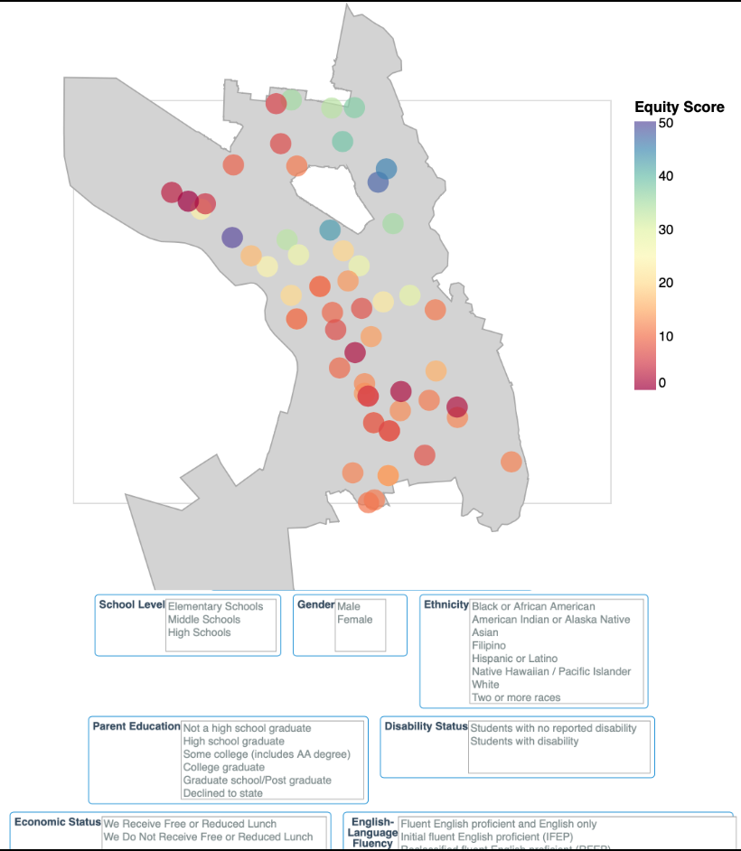

# Who's Serving Who?
## General Assembly DSI Capstone Project
_Justin August_, General Assembly Data Science Immersive Fall 2019, SF Campus

## Table of Contents
1. [Context](#Context)
2. [Initial Proposal & Check In Updates](#Initial-Proposal)
3. [Data Sources, Collection & Storage](#Data)
4. [Intersectional Analysis & Equity Scoring](#Intersectional-Analysis-Equity-Scoring)
5. [Visualization](#Visualization)
6. [Web Access](#Web-Access)
7. [Future Plans](#Future-Plans)
8. [Media & Demonstration Links](#Media-Demonstration-Links)

## Context

Oakland Schools in 2019 face many challenges and thus so do parents and students when deciding where to send their child. Due to the low overall achievement of Oakland's schools, each student is eligible to request placement in another school. Historically the "desirable" schools have been located in predominately affluent, whiter areas of the city with those students' outcomes skewing the overall results.

How and where should parents of color look to find a school that has high student outcomes for children like their own?

## Initial Proposal
|Project Name|Goal / Outcome|Audience|Metrics|Data Source|Pros|Cons|Reasonable|
|---|---|---|---|---|---|---|---|
|School Success Map / Who's Serving Who?|Create a model that can predict a child's probability of achieving different success metrics at each school. Based on widely aggregated data such as socioeconomic indicators, learning differences, gender/sex, race/ethnicity, etc. Turn this into a web app where you can enter this information in - or exclude some - to find out the probability of schools serving your child well based on an outcome of your choosing.|Parents, Students|GPA, College Acceptance, Reading levels, Math Levels, High Stakes Tests, SAT/ACT Scores, High School graduation rates|State school information, ??|Content Knowledge, usable, important|Lots of data, perhaps too mission critical for some?|Initial Component|

### Update for Check-In 2
#### This Iteration
##### Definites
- Outcoming correlations on CAASSP by:
    - Ethnicity
    - Race
    - Gender
    - Immigration Status
    - EL Proficiency
- Interactive Map 
- Enter your child's demo info, get a map
- SQL Back End using SQLAlchemy + PostgresSQL

##### Stretch Goals
- Trend in outcomes over time
- Mobile Friendly

## Data
### Sources
#### California Department of Education
- [Research Files](https://caaspp-elpac.cde.ca.gov/caaspp/ResearchFileList?ps=true&lstTestYear=2019&lstTestType=B&lstCounty=00&lstDistrict=00000&lstSchool=0000000)
These are the standardized, official research files provided by the State

#### National Center of Education Statistics
- [Metadata from Search](https://nces.ed.gov/ccd/schoolsearch/)
This information used for details regarding school location.

#### City of Oakland
- [Shape File](https://data.oaklandnet.com/Property/City-of-Oakland-City-Limits/9bhq-yt6w)

### Cleaning
-`null` values were coded as `*`. These were replaced with `0` using PANDAS en route to the SQL DB

### Storage
Data was read in from csv files and then the small amount of cleaning was completed before importing them into a Postgres SQL DB
#### PostgresSQL Structure
|Name|Description|
|---|---|
|who serving who|DB containing tables|
|caaspp metadata|Table containing metadata of schools such as addresses, lat/long, charter status, etc|
|caaspp_2019 entities| Table describing entities with results (districts, schools)|
|caaspp subgroups| Table with descriptive data for demographic subgroups|
|caaspp tests|Table with descriptive data for CAASPP Tests|
|caaspp_2019|Main table with results for each entity by test, subgroup and grade|

## Intersectional Analysis Equity Scoring

### Initial Plan

- Balanced Score based on impact of demographic on outcome
- Example: being a girl raises average reading score by 10% but being White raises it by 20%

#### Not Currently Pursued

- Assumption of equal distribution creates false confidence in outcomes
- Per-student scoring and demographic information needed to accurately calculate

### Current Iteration

- Averages proficiency levels of all grades in school level (ie: 3rd, 4th, 5th in Elementary)
- Averages proficiency levels of demographics to create “Equity Score" (ie: 50% of girls and 60% of White students = 55% of white girls)
Scale 0-100

## Visualization

[Altair](https://altair-viz.github.io/)
- Altair provides a wrapper to use Python to create [Vega](https://vega.github.io/vega/) visualizations
- Allows for interactive and complex visualizations with transformations of data
- Embeddable in web pages and apps

### School Level Maps

- Show performance in the whole district
- Can see performance differences change dynamically
- Able to drill down by components of the “Equity Score”
- More of an exploratory tool
- Demographic Selectors
- School Selectors
- Dynamically changes
- Shows % of Students in that Demographic Meeting or Exceeding State Standards

### Intersectional Identity Maps

- Allow you to customize it “for you”
- Easily shareable
- Use the “Equity Score” which can be updated in the future to include more components
- User Inputs:
	- School Level
	- Demographic Information
- Shows “Equity Score”
- Shareable by links

## Web Access

- [Flask](https://www.fullstackpython.com/flask.html)
	- By using Flask to locally demo and edit my app, I was able to get it to be fully interactive.

- [Heroku](http://heroku.com)
	- Heroku allows for deployment of Flask-based Python apps to the web
	- Native Postgres support

## Future Plans

### Moving Slow & Not Breaking Things
|Pros|Cons|
|---|---|
|Increased access of information to parents |Increased segregation of students|
|Matching students to schools | Justification for school closures|
|Uses an Intersectional Identity first approach | Does not address underlying issues of different achievement levels|
| |Currently based solely on high stakes testing |

### Collaborations
Currently in contact with Studio Pathways and Educate78, two Oakland-based Education organizations for guidance on improvements, deployment and potential use of this app.

### Immediate Feature Additions
- Historical trendlines for proficiency scores
- GreatSchools API Information
- School Level reports

### Long-Term Feature Additions
- Inclusion of non-High Stakes test metrics
	- Attendance
	- Teacher Tenure
	- Staff Makeup
	- Pedagogical Outlook
- Mobile-friendly
- Commute Calculation

## Media Demonstration Links
- [Google Slides](https://docs.google.com/presentation/d/1DCa1Db2Y9ZnPJ1c0GazXoVGmBHjDkCz7hdzOmm3LE64/edit?usp=sharing)
- [App Website](https://who-serving-who.herokuapp.com/)
